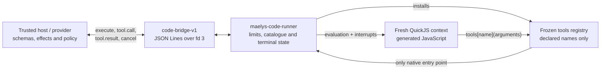
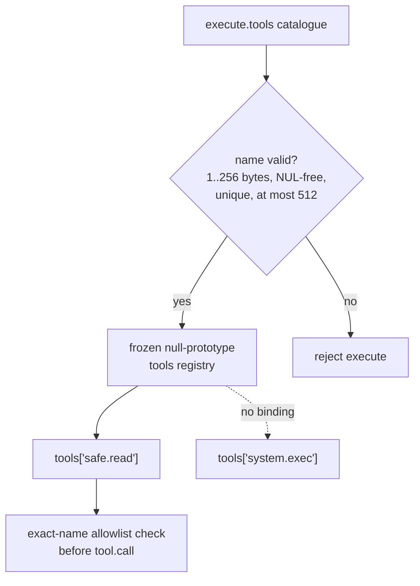
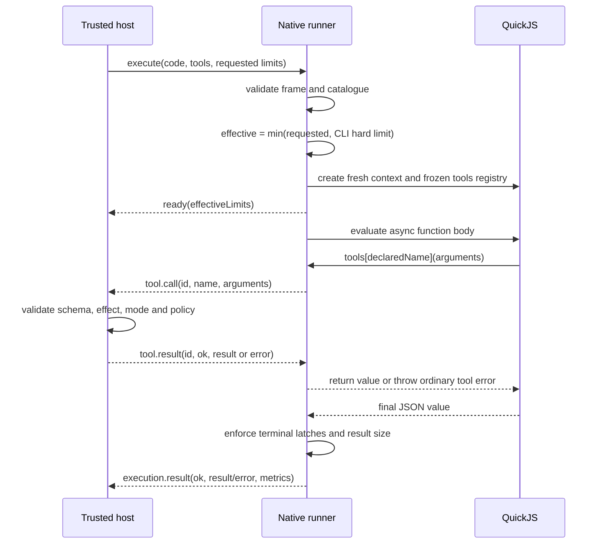
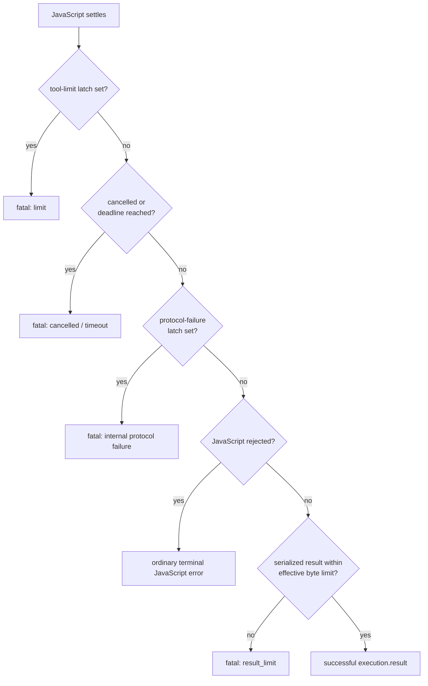
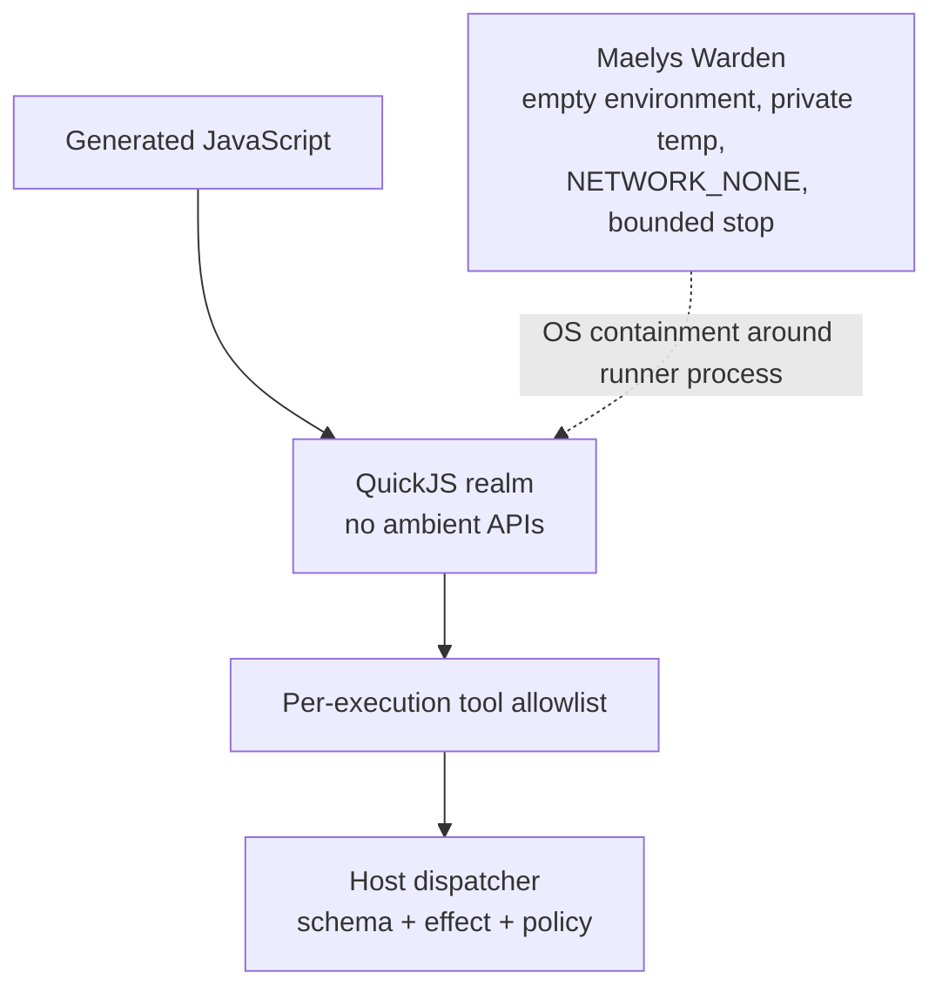

# QuickJS runner and capability boundary

`maelys-code-runner` executes one generated JavaScript program in one fresh
QuickJS-NG runtime. It is deliberately smaller than a general JavaScript
runtime: generated code receives the standard ECMAScript language and one
explicit `tools` registry, but no filesystem, process, environment, module or
network API.

This document explains the guarantees implemented by the runner, how the
`code-bridge-v1` host participates in them, and which guarantees still require
Maelys Warden.

## Architecture



The runner does not dispatch provider handlers itself. Every generated tool
call crosses fd 3 and re-enters the trusted host. The host remains responsible
for validating the tool's JSON Schema, effect, current mode and authorization.
The runner independently enforces the per-execution name allowlist and basic
bridge shape.

One process serves one `execute` frame and creates a fresh QuickJS runtime and
context. No JavaScript state survives into another execution.

## Capability-empty JavaScript context

The executable links the QuickJS core library, not `quickjs-libc`, and does not
install a module loader. Consequently generated code has no binding for:

- `std` or `os` from QuickJS's optional libc helpers;
- `fs`, `require` or another module-loading API;
- `fetch` or another network API;
- `process` or `process.env`.

The bootstrap briefly installs a native dispatcher, builds the public registry,
deletes the dispatcher from the global object, freezes the registry and makes
the `tools` global non-writable and non-configurable. The registry has a null
prototype, so inherited object names do not become accidental capabilities.



For example, an execution that receives only `hermes.content.search` observes:

```js
typeof tools["hermes.content.search"]; // "function"
typeof tools["hermes.content.apply"];  // "undefined"
Object.getPrototypeOf(tools);          // null
```

This is a capability boundary, not merely source filtering. The runner does
not depend on an AST lint to stop a forbidden call. It simply does not expose a
callable binding for an omitted name, and `invoke_tool()` repeats the exact-name
allowlist check before emitting a frame.

## Execution lifecycle



`ready` is emitted before generated code starts and reports the limits actually
retained by the runner:

```json
{
  "version": "code-bridge-v1",
  "type": "ready",
  "executionId": "example-1",
  "runnerVersion": "0.1.1",
  "effectiveLimits": {
    "maxToolCalls": 32,
    "maxResultBytes": 262144,
    "timeoutMs": 3000
  }
}
```

Each value is the smaller of the value requested in `execute.limits` and the
absolute command-line limit. `maxToolCalls` may be zero in an execution request;
`maxResultBytes` and `timeoutMs` must be positive. Generated JavaScript cannot
read or modify the native limit structure.

A minimal successful tool exchange uses five newline-delimited frames:

```text
host   -> runner  execute       { code, tools, limits }
runner -> host    ready         { effectiveLimits }
runner -> host    tool.call     { id: 1, name: "math.double", arguments: { value: 21 } }
host   -> runner  tool.result   { id: 1, ok: true, result: { value: 42 } }
runner -> host    execution.result { ok: true, result: { value: 42 }, metrics: ... }
```

## Catchable errors and fatal execution state

An ordinary provider rejection is part of program control flow. A
`tool.result` with `ok: false` becomes a JavaScript exception and may be caught:

```js
try {
  return await tools["catalog.read"]({ id: "missing" });
} catch (error) {
  return { found: false };
}
```

By contrast, containment failures are recorded in native state outside the
JavaScript exception mechanism. Catching the immediate QuickJS exception does
not clear that state. After evaluation, the runner checks terminal conditions
before accepting a JavaScript result.



The distinction is observable:

| Condition | Can generated `try/catch` turn it into success? | Enforcement |
|---|---:|---|
| Provider returns `tool.result` with `ok: false` | Yes | JavaScript exception |
| Undeclared tool or invalid arguments shape | Yes, but no tool call occurs | Native dispatcher throws |
| Tool-call quota reached | No | Native `tool_limit_exceeded` latch |
| Mismatched or invalid response during a tool exchange | No | Native `protocol_failed` latch |
| Busy-JavaScript wall-clock deadline | No | QuickJS interrupt plus native deadline check |
| Bridge cancellation while executing or waiting for a result | No | Reader-thread atomic flag plus interrupt/wakeup |
| Final serialized result too large | No | Native post-evaluation size check |
| Ordinary uncaught JavaScript exception | Not applicable | Terminal `javascript` error |

The call that would exceed the quota is not emitted. For a limit of one, this
program still terminates with `TOOL_CALL_LIMIT_EXCEEDED`, not `"escaped"`:

```js
await tools["counter.next"]({});
try {
  await tools["counter.next"]({});
} catch (_) {
  // The JavaScript exception is caught, but the native fatal latch remains set.
}
return "escaped";
```

Heap and stack limits are hard QuickJS ceilings, but their JavaScript exception
may be catchable. Catching it does not raise or disable the ceiling. The outer
wall-clock and Executor process deadlines remain necessary containment layers.

## Bridge validation and correlation

Bridge frames are newline-delimited JSON objects. The reader rejects embedded
NUL bytes, duplicate object keys, non-object JSON and frames exceeding the
absolute frame limit. Its receive queue is capped at eight frames; overflow is
a fatal protocol failure that interrupts generated code. Tool results must
carry `version: "code-bridge-v1"`, type
`tool.result`, a boolean `ok` and the exact outstanding numeric call ID.

Tool arguments must be a non-array JavaScript object that serializes back to a
JSON object. This is deliberately not full input-schema validation. The trusted
host must run the provider's schema validator before invoking a handler.

The bridge has one reader thread so a `cancel` frame can be observed while
QuickJS is executing. Writes remain serialized on the runner thread, preserving
the one-writer transport rule.

## Defence in depth



No single layer is presented as sufficient:

1. the QuickJS realm removes ambient JavaScript capabilities;
2. the execution catalogue grants only named tool capabilities;
3. the host revalidates every call and applies effect policy;
4. Maelys Warden supplies the actual operating-system boundary and forced
   process-tree termination.

## Limits and non-guarantees

- The runner alone does **not** prove filesystem or network isolation at the OS
  level. Production use requires a confining Seatbelt or Bubblewrap Executor
  backend. The generic POSIX backend is for development, not strong confinement.
- The native wall-clock interrupt bounds JavaScript while QuickJS is running.
  In v1, waiting for a host that never sends `tool.result` has no internal timed
  condition wait; the provider deadline and Executor stop escalation must bound
  that case.
- A `cancel` bridge frame wakes both busy JavaScript and a pending bridge wait.
  SIGINT/SIGTERM is proven by tests for busy JavaScript; Executor remains the
  authoritative bounded-stop mechanism for the whole process lifecycle.
- The final-result limit applies after JSON serialization. It does not replace
  the QuickJS heap limit for intermediate values or the bridge frame limit for
  individual protocol messages.
- The runner validates tool names and the arguments' JSON-object shape, not the
  provider-specific input schema, authorization or semantic safety.
- Code Mode v1 has one outstanding tool call and one execution per process. It
  intentionally provides no persistent JavaScript context.

## Verification

Build and run the focused runner and bridge tests:

```sh
make check
```

The named conformance cases cover the properties described above:

```sh
build/release/maelys-code-runner --version

python3 tests/test_bridge_conformance.py \
  build/release/maelys-code-runner -v

python3 tests/test_runner.py \
  build/release/maelys-code-runner -v
```

In particular:

- `test_structured_result_and_empty_capability_global` checks the absent global
  bindings;
- `test_ready_reports_clamped_effective_limits` checks clamping and `ready`;
- `test_tool_limit_is_fatal_and_not_catchable` checks the native quota latch;
- `test_timeout_is_fatal_outside_generated_javascript` checks the deadline
  cannot be converted to success;
- `test_protocol_failure_is_fatal_and_not_catchable` checks response
  correlation and the protocol-failure latch;
- `test_provider_tool_error_remains_catchable` checks the deliberate ordinary
  error path;
- `test_allowlist_omission_removes_callable_binding` checks per-execution
  capability distribution;
- the runner integration suite checks cancellation, signals, heap, stack,
  result size, malformed frames and successful tool round trips.

For release qualification, run the sanitizer and fuzz targets in their separate
build directories as required by `AGENTS.md`:

```sh
make asan-ubsan
make tsan
make fuzz-smoke
```

The cross-project OS-confinement test belongs to Maelys Warden, not this
repository:

```sh
make -C /path/to/maelys-warden code-runner-e2e \
  CODE_RUNNER="$PWD/build/release/maelys-code-runner"
```

See also the normative [`code-bridge-v1`](code-bridge-v1.md) contract and the
[Warden integration](warden-integration.md) requirements.
